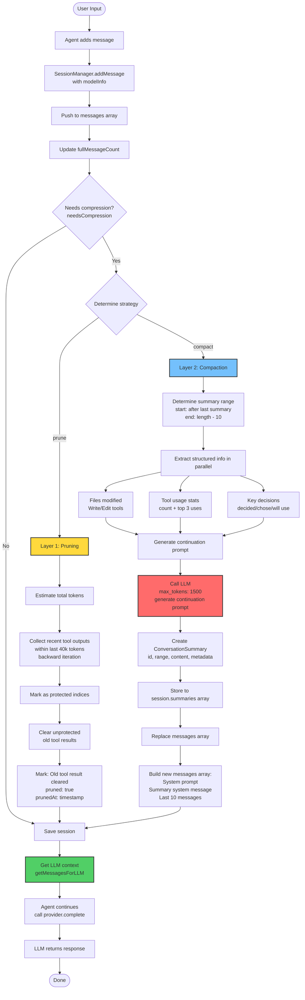
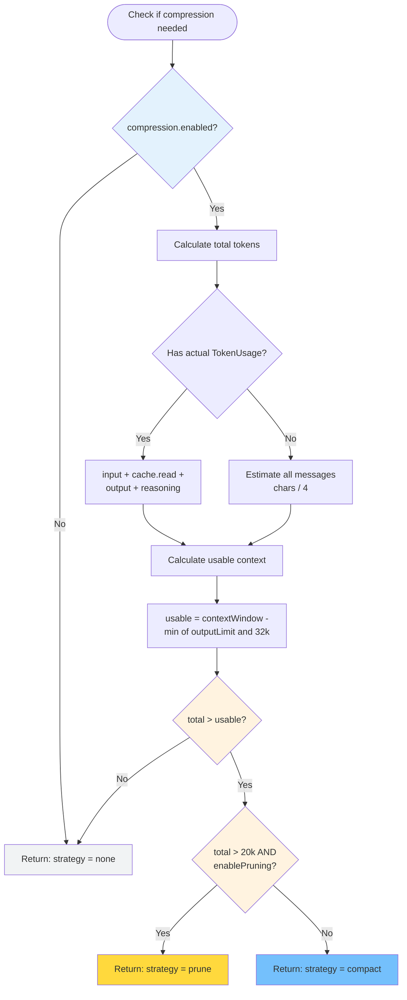

# Session Compression Implementation Guide

Complete documentation for the three-layer session compression system in GenCode.

## Table of Contents

1. [Overview](#overview)
2. [Architecture](#architecture)
3. [Flowcharts](#flowcharts)
4. [Strategy Details](#strategy-details)
5. [Testing](#testing)
6. [Configuration](#configuration)

---

## Overview

### Goal

Session compression enables GenCode to handle long conversations efficiently by:
- Reducing context size when approaching model limits
- Preserving critical information (decisions, file changes)
- Minimizing API costs

### Three-Layer Strategy

| Layer | Name | Trigger | Cost | Effect |
|-------|------|---------|------|--------|
| **Layer 1** | Tool Output Pruning | Tokens > 20k | 🟢 Free | Remove old tool outputs, keep recent 40k |
| **Layer 2** | Compaction | Tokens > usable context | 🟡 Medium | LLM generates continuation prompt |
| **Layer 3** | Message Filtering | Session recovery | 🟢 Free | Return compressed message array |

### File Structure

```
src/session/compression/
├── types.ts          # Type definitions and defaults (103 lines)
├── engine.ts         # Three-layer compression engine (396 lines)
└── index.ts          # Public API exports

Integration points:
├── src/session/manager.ts    # SessionManager integration (lines 310-343, 407-554)
├── src/agent/agent.ts        # Agent integration (lines 66, 448, 504, 543, 597-604)
└── src/config/types.ts       # Config system integration
```

---

## Architecture

### Design Principles

1. **OpenCode Alignment**: Three-layer strategy matches OpenCode's proven approach
2. **Provider Agnostic**: Works with any LLM provider (Anthropic, OpenAI, Gemini)
3. **Quality First**: Structured metadata ensures no information loss
4. **Cost Conscious**: Free pruning before expensive summarization

### Key Components

**CompressionEngine** (`src/session/compression/engine.ts`)
- Token estimation (4:1 char-to-token ratio)
- Compression strategy selection
- Tool output pruning
- LLM-based compaction
- Information extraction (files, tools, decisions)

**SessionManager** (`src/session/manager.ts`)
- Triggers compression on `addMessage()`
- Stores summaries in session JSON
- Replaces message array with compressed version
- Provides `getMessagesForLLM()` for context

**Agent** (`src/agent/agent.ts`)
- Passes `modelInfo` for compression decisions
- Uses compressed context transparently
- Exposes `getCompressionStats()`

---

## Flowcharts

### Complete Workflow



### Compression Decision Logic



---

## Strategy Details

### Layer 1: Tool Output Pruning

**Implementation**: `src/session/compression/engine.ts:117-159`

#### Purpose
Quick, cost-free reduction of context size by removing old tool outputs.

#### Algorithm

1. **Check threshold**: Exit if total tokens < 20k
2. **Backward iteration**: Collect recent tool results
   - Start from end of messages array
   - Accumulate up to 40k tokens
   - Store protected indices in Set
3. **Forward iteration**: Clear unprotected results
   - Skip messages in protected set
   - Replace `content` with `"[Old tool result cleared]"`
   - Mark with `pruned: true` and `prunedAt: timestamp`
4. **Return stats**: Count and saved tokens

#### Design Decisions

| Decision | Rationale |
|----------|-----------|
| 20k threshold | Balance efficiency vs necessity |
| 40k protection | ~10-20 conversation turns of context |
| Backward iteration | Prioritize recent outputs |
| Mark not delete | Preserve message structure for debugging |
| Timestamp tracking | Auditability and transparency |

#### Example

```typescript
// Before pruning
{
  role: 'user',
  content: [
    { type: 'tool_result', toolUseId: 'old-1', content: '... 5000 chars ...' }
  ]
}

// After pruning
{
  role: 'user',
  content: [
    {
      type: 'tool_result',
      toolUseId: 'old-1',
      content: '[Old tool result cleared]',
      pruned: true,
      prunedAt: '2026-01-18T10:30:00.000Z'
    }
  ]
}
```

### Layer 2: Compaction

**Implementation**: `src/session/compression/engine.ts:165-223`

#### Purpose
Generate a "continuation prompt" that preserves context for future work.

#### Algorithm

1. **Determine range**:
   - Start: After last summary (or beginning)
   - End: Current length - 10 (preserve recent)
2. **Extract structured info** (parallel):
   - Files modified (from Write/Edit tools)
   - Tool usage statistics
   - Key decisions (contains "decided", "chose", "will use")
3. **Generate continuation prompt**:
   - Call LLM with specialized prompt
   - max_tokens: 1500
   - Focus: What's needed to continue, not just what was done
4. **Create summary object**:
   - Unique ID: `sum-{timestamp}-{random}`
   - Type: "compaction"
   - Range: `[start, end]`
   - Content: Continuation prompt
   - Metadata: decisions, files, tools
5. **Replace messages**:
   - Keep: System prompt
   - Add: Summary as system message
   - Keep: Last 10 messages

#### Continuation Prompt Template

```
Provide a detailed prompt for continuing our conversation above.

Focus on information that would be helpful for continuing the conversation:
1. What we accomplished so far
2. What we're currently working on
3. Which files we modified and key changes made
4. What we plan to do next
5. Any important context or decisions that would be needed

Remember: The new session will NOT have access to our full conversation history,
so include all essential context needed to continue working effectively.

Be technical and specific. Use structured bullet points.
```

#### Design Decisions

| Decision | Rationale |
|----------|-----------|
| "Continuation" not "summary" | Focus on future needs, not past actions |
| Structured extraction | Ensure no critical info lost even if LLM summary incomplete |
| max_tokens: 1500 | Detailed but not excessive |
| Keep last 10 messages | Maintain conversation continuity |
| Configurable model | Allow cheaper model (e.g., Haiku) for summarization |

#### Summary Format

```typescript
{
  id: "sum-1737202200000-abc123",
  type: "compaction",
  coveringMessages: [1, 100],
  content: "We accomplished implementing JWT authentication...",
  keyDecisions: ["Decided to use JWT with refresh tokens"],
  filesModified: ["src/auth.ts", "src/login.tsx"],
  toolsUsed: [
    { tool: "Write", count: 5, notableUses: ["Modified src/auth.ts"] }
  ],
  generatedAt: "2026-01-18T10:30:00.000Z",
  estimatedTokens: 350
}
```

### Layer 3: Message Filtering

**Implementation**: `src/session/manager.ts:520-530`

#### Purpose
Optimize session recovery by returning compressed messages.

#### Current Implementation

```typescript
getMessagesForLLM(): Message[] {
  if (!this.currentSession) return [];

  // If no summaries, return all messages
  if (!this.currentSession.summaries?.length === 0) {
    return this.currentSession.messages;
  }

  // Messages already include summary (built in performCompaction)
  return this.currentSession.messages;
}
```

#### Status

- ✅ Basic support: Returns compressed message array
- ✅ Storage optimization: Summaries embedded in session JSON
- ⚠️ Not implemented: Streaming load, CompactionPart markers (OpenCode feature)

---

## Testing

### Automated Tests

Run the test suite:

```bash
# Make script executable
chmod +x scripts/test-compression.sh

# Run all tests
./scripts/test-compression.sh
```

### Unit Test Structure

```typescript
describe('CompressionEngine', () => {
  describe('estimateTokens', () => {
    it('uses 4:1 char-to-token ratio');
    it('handles empty strings');
  });

  describe('needsCompression', () => {
    it('returns none when under limit');
    it('returns prune when >20k tokens');
    it('returns compact when <20k but over limit');
    it('respects enabled flag');
  });

  describe('pruneToolOutputs', () => {
    it('does not prune when <20k tokens');
    it('protects recent 40k tokens');
    it('clears old tool results with pruned marker');
    it('returns accurate stats');
  });

  describe('compact', () => {
    it('extracts files modified from Write/Edit');
    it('counts tool usage');
    it('extracts key decisions');
    it('calls LLM with continuation prompt');
    it('returns complete ConversationSummary');
  });
});
```

### Manual Testing

#### Test 1: Long Conversation

```bash
npm start
```

```javascript
> Help me create 50 test files with different content

// After agent completes...

> Show compression stats
// Expected:
//   totalMessages > activeMessages
//   summaryCount > 0
//   compressionRatio < 1.0
```

#### Test 2: Tool Output Pruning

```bash
# Start session
npm start

> Read all TypeScript files in the project and summarize them

// In another terminal
SESSION_FILE=$(ls -t ~/.gen/sessions/*.json | head -1)
cat "$SESSION_FILE" | jq '.messages[] | select(.content[0].pruned == true)'

// Expected: Messages with pruned: true and prunedAt timestamp
```

#### Test 3: Session Recovery

```bash
npm start

> Implement a user authentication system using JWT

# After implementation
> /save
> /exit

# Restart
npm start
> /resume

> What authentication scheme did we choose?

// Expected: Agent correctly recalls "JWT"
```

### Performance Metrics

| Metric | Target | How to Measure |
|--------|--------|----------------|
| Compression ratio | 60-70% reduction | Compare totalMessages vs activeMessages |
| Summary generation | < 5 seconds | Time the `compact()` call |
| Token savings | 50-60% | Compare before/after token estimates |
| Context quality | 100% key info retained | Manual verification of summaries |
| Pruning speed | < 100ms | Time the `pruneToolOutputs()` call |

### Session File Verification

```bash
# Find latest session
SESSION_FILE=$(ls -t ~/.gen/sessions/*.json | head -1)

# Check structure
jq '{
  totalMessages: .fullMessageCount,
  activeMessages: (.messages | length),
  summaryCount: (.summaries | length)
}' "$SESSION_FILE"

# View summary content
jq '.summaries[0]' "$SESSION_FILE"

# Check for pruned messages
jq '.messages[] | select(.content[]?.pruned == true)' "$SESSION_FILE"
```

---

## Configuration

### Default Settings

```typescript
// src/session/compression/types.ts
export const DEFAULT_COMPRESSION_CONFIG: CompressionConfig = {
  enabled: true,
  enablePruning: true,
  enableCompaction: true,
  pruneMinimum: 20_000,        // Min tokens to trigger pruning
  pruneProtect: 40_000,        // Protect recent 40k tokens
  reservedOutputTokens: 32_000, // Reserve 32k for output
};
```

### User Configuration

Add to `~/.gencode/settings.json`:

```json
{
  "compression": {
    "enabled": true,
    "enablePruning": true,
    "enableCompaction": true,
    "pruneMinimum": 20000,
    "pruneProtect": 40000,
    "reservedOutputTokens": 32000,
    "model": "claude-haiku-3-5"  // Optional: cheaper model for summaries
  }
}
```

### Tuning Guide

| Scenario | pruneMinimum | pruneProtect | model | Effect |
|----------|--------------|--------------|-------|--------|
| **Low cost** | 10k | 20k | haiku | More frequent compression, lower cost |
| **Balanced** | 20k | 40k | current | Default, balanced quality/cost |
| **High quality** | 30k | 60k | sonnet | More context retained, higher cost |

### Model Context Windows

| Model | Context Window | Output Limit | Usable Context |
|-------|----------------|--------------|----------------|
| Claude Sonnet | 200,000 | 8,192 | 191,808 |
| GPT-4o | 128,000 | 4,096 | 123,904 |
| Gemini 2.0 | 1,000,000 | 8,192 | 991,808 |

---

## Implementation Highlights

### ADR-1: 4:1 Token Estimation

**Context**: Need fast token estimation without heavy dependencies

**Decision**: Use 4:1 character-to-token ratio (OpenCode's validated approach)

**Pros**:
- Zero dependencies, instant calculation
- ±10% accuracy for English text
- Production-validated

**Cons**:
- 20-30% underestimate for Chinese
- 15-20% overestimate for code

**Mitigation**:
- Use conservative thresholds
- Prefer actual TokenUsage when available
- Future: Optional tiktoken support

**Code**: `src/session/compression/engine.ts:36-48`

### ADR-2: Backward Iteration for Protection

**Context**: Tool outputs consume many tokens, recent ones most important

**Decision**: Iterate backward, protect last 40k tokens of tool outputs

**Pros**:
- Guarantees most recent context preserved
- 40k ≈ 10-20 conversation turns
- Avoids accidentally removing critical outputs

**Implementation**: O(n) time using Set for protected indices

**Code**: `src/session/compression/engine.ts:131-142`

### ADR-3: Continuation Prompt Philosophy

**Context**: Traditional summaries focus on "what was done", but new sessions need "how to continue"

**Decision**: Generate "continuation prompts" instead of summaries

**Template Structure**:
1. What we accomplished (past)
2. Current work (present)
3. Files modified + changes (context)
4. Next steps (future)
5. Important decisions (context)

**Effect**: More actionable summaries, Agent can naturally continue work

**Code**: `src/session/compression/engine.ts:196-223`

---

## Appendix

### Type Definitions

```typescript
export interface CompressionConfig {
  enabled: boolean;
  enablePruning: boolean;
  enableCompaction: boolean;
  pruneMinimum: number;
  pruneProtect: number;
  reservedOutputTokens: number;
  model?: string;
}

export interface ConversationSummary {
  id: string;
  type: 'compaction';
  coveringMessages: [number, number];
  content: string;
  keyDecisions: string[];
  filesModified: string[];
  toolsUsed: ToolUsageSummary[];
  generatedAt: string;
  estimatedTokens: number;
}

export interface ToolUsageSummary {
  tool: string;
  count: number;
  notableUses: string[];
}

export interface TokenUsage {
  input: number;
  output: number;
  reasoning?: number;
  cache?: {
    read: number;
    write: number;
  };
}
```

### Session JSON Example

```json
{
  "metadata": {
    "id": "abc123",
    "title": "Implement Auth System",
    "messageCount": 42,
    "fullMessageCount": 156
  },
  "messages": [
    { "role": "system", "content": "..." },
    {
      "role": "system",
      "content": "[Earlier conversation - 100 messages summarized]\n\nWe accomplished implementing JWT authentication..."
    },
    { "role": "user", "content": "..." }
  ],
  "summaries": [
    {
      "id": "sum-1737202200000-abc123",
      "type": "compaction",
      "coveringMessages": [1, 100],
      "content": "We accomplished implementing JWT authentication...",
      "keyDecisions": ["Decided to use JWT with refresh tokens"],
      "filesModified": ["src/auth.ts", "src/login.tsx"],
      "toolsUsed": [
        { "tool": "Write", "count": 5, "notableUses": ["Modified src/auth.ts"] }
      ],
      "generatedAt": "2026-01-18T10:30:00.000Z",
      "estimatedTokens": 350
    }
  ]
}
```

### Quick Reference

**Check if compression is working:**
```typescript
const stats = agent.getCompressionStats();
console.log(stats);
// {
//   totalMessages: 156,
//   activeMessages: 42,
//   summaryCount: 2,
//   compressionRatio: 0.269
// }
```

**Manually trigger compression:**
```typescript
// Compression happens automatically in SessionManager.addMessage()
// when tokens exceed usable context
```

**Disable compression:**
```json
{
  "compression": {
    "enabled": false
  }
}
```

---

**Document Version**: 1.0
**Last Updated**: 2026-01-18
**Maintained By**: GenCode Team
